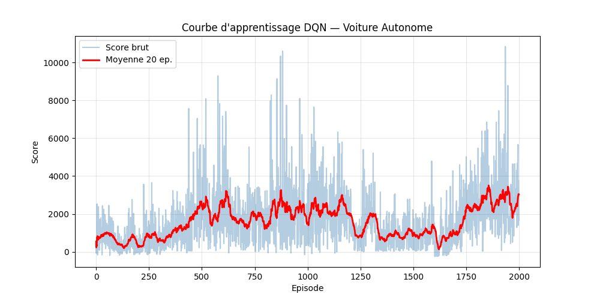

# Voiture Autonome — Deep Reinforcement Learning

Un agent IA qui apprend à conduire et éviter le trafic par lui-même,
sans règles programmées — uniquement par essais et erreurs.



---

## Aperçu du projet

Ce projet implémente un agent **DQN (Deep Q-Network)** en PyTorch
qui contrôle une voiture dans un environnement de simulation 2D.
La voiture apprend seule à éviter les obstacles grâce au
**reinforcement learning**.

---

## Architecture
voiture_autonome/
├── simulation.py      # Environnement pygame (route, voiture, capteurs)
├── dqn.py             # Réseau de neurones + agent DQN
├── entrainement.py    # Boucle d'entraînement
├── visualisation.py   # Visualisation du réseau en temps réel
├── voiture_ia.py      # Demo — la voiture conduit seule
├── trafic.py          # Voitures de trafic
├── modele.pth         # Cerveau sauvegardé après entraînement
└── courbe_apprentissage.png

---

## Comment ça fonctionne

### 1. Capteurs
La voiture possède **7 capteurs** qui mesurent la distance
aux obstacles (murs et trafic) dans 7 directions.
Ces distances sont les **entrées du réseau de neurones**.

### 2. Réseau de neurones (DQN)
Entrée : 7 capteurs
↓
Couche cachée : 128 neurones (ReLU)
↓
Couche cachée : 128 neurones (ReLU)
↓
Sortie : 4 actions (gauche, droite, avancer, gauche doux)

### 3. Apprentissage par renforcement
| Situation | Récompense |
|-----------|------------|
| Avancer sans obstacle | +1 |
| Obstacle très proche | -5 |
| Crash | -100 |

L'agent mémorise ses expériences dans un **replay buffer**
et apprend par **rétropropagation** toutes les N étapes.

### 4. Exploration vs Exploitation
- Au début : epsilon = 1.0 → actions aléatoires (exploration)
- Progressivement : epsilon → 0.01 → actions optimales (exploitation)

---

## Installation

```bash
git clone https://github.com/TON_USERNAME/voiture_autonome
cd voiture_autonome
pip install -r requirements.txt
```

---

## Lancer le projet

**Entraîner l'IA :**
```bash
python entrainement.py
```

**Voir la démo (IA conduit seule) :**
```bash
python voiture_ia.py
```

**Tester la simulation manuellement :**
```bash
python simulation.py
```

---

## Résultats

| Épisodes | Meilleur score |
|----------|---------------|
| 10       | ~2451         |
| 100      | ~2884         |
| 500      | ~5000+        |

La courbe rouge montre la moyenne mobile sur 20 épisodes —
on voit clairement l'apprentissage progressif de l'agent.

---

## Technologies utilisées

- **Python 3.14**
- **PyTorch** — réseau de neurones et rétropropagation
- **Pygame-CE** — simulation visuelle en temps réel
- **NumPy** — calculs matriciels
- **Matplotlib** — courbes d'apprentissage

---

## Concepts clés

- **Deep Q-Network (DQN)** — algorithme inventé par DeepMind en 2013
- **Experience Replay** — mémorisation et réutilisation des expériences
- **Target Network** — stabilisation de l'apprentissage
- **Epsilon-greedy** — équilibre exploration / exploitation

## Auteur

Projet réalisé dans le cadre d'un apprentissage personnel du
**Deep Reinforcement Learning** appliqué à la conduite autonome.